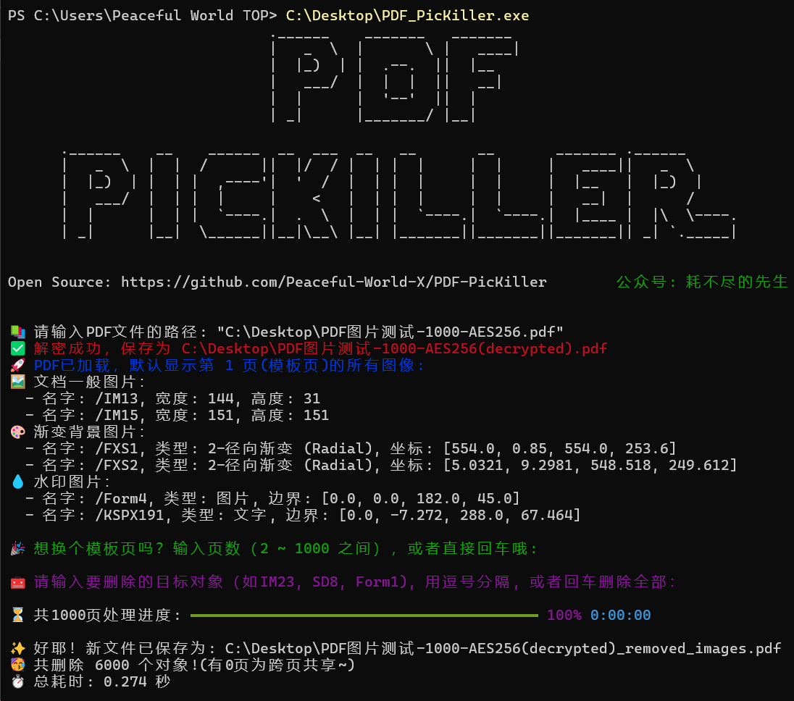

<p align="center">
  
</p>

<p align="center">
  
  
  
  
  
  
  
</p>

<h1 align="center" style="font-size: 64px;">PDF PicKiller 
  <a href="https://github.com/Peaceful-World-X/PDF-PicKiller/releases/download/V1.0/PDF_PicKiller_V1.0.exe" download>点击下载⚡</a>
</h1>


### 🤖 PDF PicKiller 是基于Python的PDF批处理工具，默认**无感解密**，使用命令行界面批量删除**固定位置图像**、**渐变背景图**、**水印图或字**。

## 🥳 主要功能

✨ **默认解密**：无感处理（破解）加密的 PDF 文件(有打开权限)，支持多种加密方式：**`RC4 128bits`**, **`AES 128bits`**, **`AES 256bits`** 等。

✨**图片提取**：检索模板页（默认第1页），并列出 XObject 图像、Shadings 背景图像和 Form 水印图。

✨**批量删除**：批量高效的删除列出的图像对象，平均速度为 **`0.2 秒`** 处理每 1000 页（每页 5 个删除对象）。

✨**交互式命令行**：命令行界面，表情样式回复~

## 🤪 软件使用

🟢命令行绿色可执行文件，双击食用~
1. 直接拖入PDF文件，或输入文件地址
2. 选择模板页(即有要删除图片的页面)，默认第一页则回车
3. 选择模板页中要删除的对象名，默认删除全部对象则回车
4. 已批量删除打开文件路径~
5. 随时按下 Ctrl+C 退出软件！

<p align="center">
  
</p>

## 🤗 代码编译
```bash
pip install -r requirements.txt
python code/PDF_PicKiller.py
```
✨欢迎反馈BUG，后续会视情况添加新功能！（代码是晚上为了处理一个PDF文件临时写的，有问题非常欢迎反馈~）

## 鸣谢
- [PDF Patcher](https://github.com/wmjordan/pdfpatcher)
- [译作《PDF 解析》](https://github.com/zxyle/PDF-Explained)

## 联系
<p align="left">
  
  <a href="https://mp.weixin.qq.com/s/oKylZyrSxNqMK8lUIo4RAw" style="font-size: 30px; color: green; text-decoration: none; font-family: sans-serif;">耗不尽的先生🥳</a>
</p>


